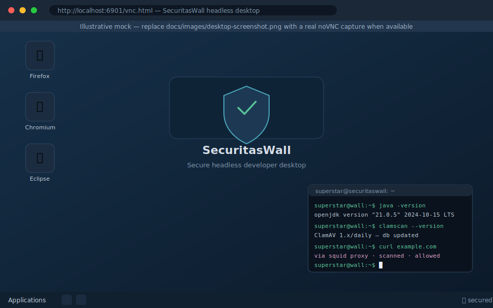
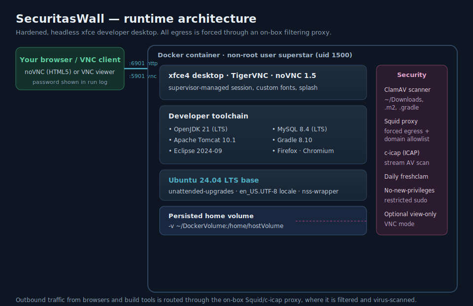
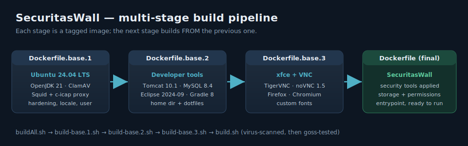

# SecuritasWall — Headless Secure Developer Desktop

[](https://releases.ubuntu.com/24.04/)
[](https://openjdk.org/projects/jdk/21/)
[](https://tomcat.apache.org/)
[](https://dev.mysql.com/doc/relnotes/mysql/8.4/en/)
[](https://www.docker.com/)
[](https://novnc.com/)
[](./LICENSE)

A hardened, **headless** Linux developer desktop you run in a browser. It bundles a full Java
toolchain inside an [xfce](https://xfce.org/) VNC session, and forces **all outbound traffic
through an on-box filtering proxy that virus-scans and allow-lists egress** — so a compromised
dependency or a malicious site has nowhere to phone home to.

> Part of the [Securitas Machina](https://www.securitasmachina.org) secure-by-default tooling family.



> The image above is an illustrative mock. Replace `docs/images/desktop-screenshot.png` with a
> real noVNC capture once you have built and launched the container.

---

## Why?

Modern breaches increasingly enter through the developer's machine and the open-source supply
chain — a vulnerable transitive dependency, a typo-squatted package, or a drive-by on a
compromised site. SecuritasWall shrinks that blast radius by giving each developer a disposable,
network-restricted desktop:

* Browsers and build tools **cannot** reach the internet directly — only through the on-box
  Squid + c-icap proxy, which filters and AV-scans the stream.
* Downloads, the Maven `.m2` cache and the Gradle `.gradle` cache are scanned by **ClamAV**.
* The container runs as an unprivileged user; only the persisted home volume survives a restart.

## Architecture



| Layer | Component |
| --- | --- |
| Base OS | **Ubuntu 24.04 LTS** (`unattended-upgrades`, UTF-8 locale, `nss-wrapper`) |
| Runtime | **OpenJDK 21 (LTS)** |
| App server | **Apache Tomcat 10.1** |
| Database | **MySQL 8.4 (LTS)** |
| IDE | **Eclipse 2024-09** |
| Build | **Gradle 8.10** |
| Desktop | xfce4 via **TigerVNC** + **noVNC 1.5** (HTML5 client) |
| Browsers | Firefox, Chromium |
| Security | ClamAV (daily `freshclam`), Squid forced-egress proxy, c-icap ICAP AV, restricted sudo, non-root `superstar` (uid 1500) |

Default ports: **`5901`** (VNC) and **`6901`** (noVNC / HTML5 over HTTP).

## Build

The image is assembled in four stages — each builds `FROM` the previous tagged image:



```bash
git clone https://github.com/SecuritasMachina/docker-headless-securitaswall
cd docker-headless-securitaswall

# Build every stage in order (base.1 → base.2 → base.3 → final)
./buildAll.sh
```

The optional developer-tool archives (Tomcat, MySQL, Eclipse) are downloaded into
`src/template/homeDir/.dockerDevTools/archives/` and unpacked at runtime by the scripts in
`src/template/homeDir/.dockerDevTools/scripts/`. The pinned versions live as `ARG`s at the top of
`Dockerfile.base.1`.

> **Behind a corporate proxy?** Uncomment and set `proxy="http://$proxy_ip:$proxy_port"` in
> `build-base.*.sh`; the build args are wired through automatically.

## Run

```bash
docker run -d \
  -p 5901:5901 -p 6901:6901 \
  --cap-add=NET_ADMIN \
  -v ~/DockerVolume:/home/hostVolume \
  ackdev/secure_proxy_securitas-wall:latest
```

Then connect with either:

* **noVNC (HTML5, no client needed):** <http://localhost:6901/vnc.html> — the password is printed
  in the container's run log.
* **A VNC viewer:** `localhost:5901`.

Print the built-in help:

```bash
docker run ackdev/secure_proxy_securitas-wall:latest --help
```

### Environment variables

| Variable | Default | Purpose |
| --- | --- | --- |
| `VNC_RESOLUTION` | `1280x1024` | Desktop resolution |
| `VNC_COL_DEPTH` | `24` | Colour depth |
| `VNC_VIEW_ONLY` | `false` | If `true`, the VNC connection is view-only (control password kept private) |

```bash
docker run -d -p 5901:5901 -p 6901:6901 -e VNC_RESOLUTION=1800x900 \
  -v ~/DockerVolume:/home/hostVolume ackdev/secure_proxy_securitas-wall:latest
```

## Security model

| Control | Detail |
| --- | --- |
| Forced egress | Browsers/tools must use the on-box Squid proxy; outbound is allow-listed (see [`src/sample/20-whitelist`](src/sample/20-whitelist)) |
| Stream scanning | c-icap (ICAP) virus-scans proxied traffic |
| At-rest scanning | ClamAV watches `~/Downloads`, `~/.m2`, `~/.gradle`; signatures refreshed daily |
| Least privilege | Runs as `superstar` (uid 1500); the sudo password only ever appears in the build log |
| Disposable | Only `/home/hostVolume` is persisted; everything else is reset on recreate |

## Hints

### Extend the image with your own software

```dockerfile
FROM ackdev/secure_proxy_securitas-wall:latest
USER 0
RUN apt-get update && apt-get install -y gedit && apt-get clean
USER 1500
```

### Run as your host user/group

```bash
docker run -it -p 6901:6901 --user $(id -u):$(id -g) \
  -v ~/DockerVolume:/home/hostVolume ackdev/secure_proxy_securitas-wall:latest
```

### Chromium crashes at high resolution

Chromium can run out of shared memory at large resolutions. Give it more `/dev/shm`:

```bash
docker run --shm-size=256m -p 6901:6901 -e VNC_RESOLUTION=1920x1080 \
  -v ~/DockerVolume:/home/hostVolume ackdev/secure_proxy_securitas-wall:latest
```

## Releasing

See [`how-to-release.md`](how-to-release.md). In short: bump the version pins, run `./buildAll.sh`,
let the build virus-scan and `goss`-test the image, then push the four tagged images.

## Contact & support

Questions, professional support or a vulnerability report:
**[help@ackdev.com](mailto:help@ackdev.com)** or open an
[issue](https://github.com/SecuritasMachina/docker-headless-securitaswall/issues/new).

Found a vulnerability? Let us know — responsible disclosures are rewarded.

## License

[Apache License 2.0](./LICENSE).
